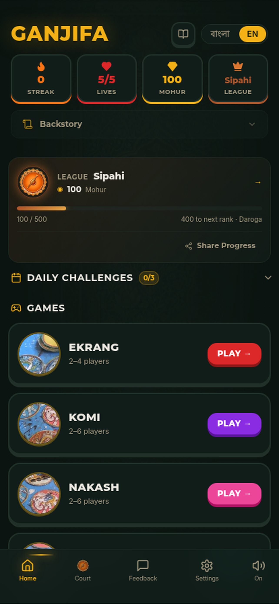
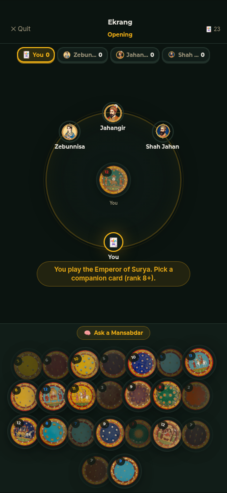
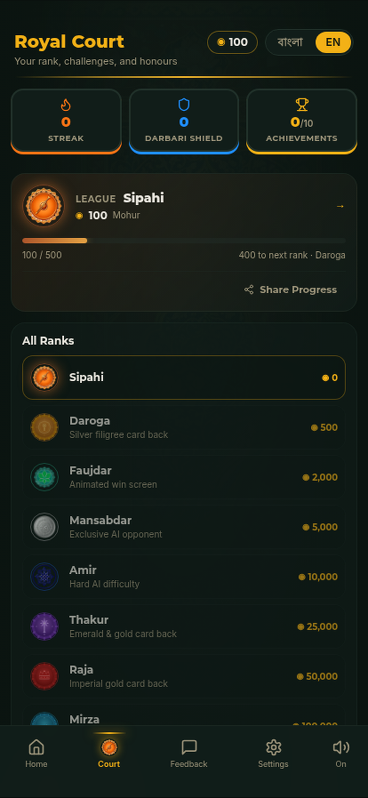
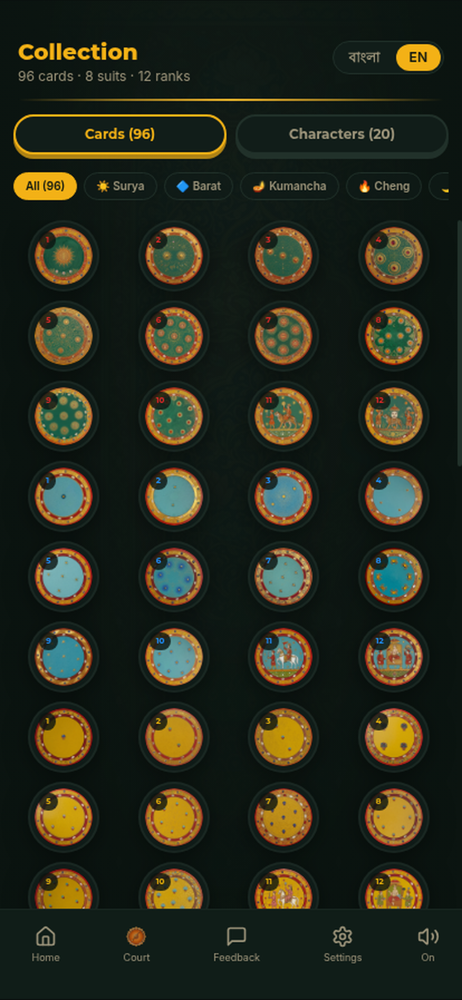

## Hi, I'm Mo 👋

I'm **Mohammed Imtiazur Rahman** — Principal Product Manager at **Intuit** with 15 years in fintech and heavily-regulated domains. I build **0→1 products**, scale **two-sided marketplaces**, and turn new products into the company standard.

I turn ambiguous, high-stakes problems into shipped product — taking on large, undefined challenges with no existing playbook, breaking them into the smallest things worth shipping, and **moving fast**: testing and iterating in market rather than planning in a vacuum.

📍 Toronto, ON · 📧 mir178@protonmail.com · [LinkedIn](https://www.linkedin.com/in/mohammedimtiazur-rahman) · 📄 **[Résumé (PDF)](Mohammed_Rahman_Resume.pdf)** · [view as page](RESUME.md)

---

### 💼 What I Work On

**Intuit** (2011 – Present)

🏗️ **Principal PM** `2022–` — TurboTax Business (0→1, **2x** quarterly target); shipped **Expert 365** (automates SMB bookkeeping document handling). Unified Live Full Service: **60%** less tech duplication, 21 days → hours, PRS 84. Led **mission teams against company OKRs** owning **unit, revenue & NPS**. **Lead Experiment PM for TurboTax Canada** — monthly tests across paper prototypes → smoke tests → A/B → built pilots. Won Scott Cook Innovation Award for a **50-customer test that became the baseline for ~500K**.

🎯 **Senior PM, Full Service** `2020–22` — **50%** SLA improvement, **3x** PRS YoY. Built two-sided consumer-expert platform across **10+** scrum teams.

🚀 **PM, TurboTax Live** `2019–20` — Migrated ~300 tax experts to central platform; **50%** time-savings.

📊 **Ops Manager** `2011–19` — Built 60-person team in 90 days (TNPS 78). Led 80 experts, 95–97% SL, record profitability. 90%+ seasonal retention.

💼 **H&R Block** `2009–11` — Branch Manager, Best Performer's Award.

---

### 🧰 Toolkit

### 🤖 AI & LLMs

---

### 🛠️ Side Projects

**🎴 [Ganjifa — Game of Emperors](https://github.com/mir17881/ganjifa-59cb8f4d)**
Heritage card app reviving the 8-suit Mughal ganjifa deck — 96 hand-painted-style cards, 6 games, Bengali/English bilingual, offline-first. Live on Play Store.

`React` `TypeScript` `Capacitor` `Supabase` `Tailwind CSS`

[ganjifa.tashkhela.com](https://ganjifa.tashkhela.com) · [Play Store](https://play.google.com/store/apps/details?id=com.ganjifa.app)

  
  
  
  

**🏛️ [Naqqash-Khanah](https://github.com/mir17881/naqqash-khanah)**
Standalone RAG corpus API for Indo-Islamic & South Asian art. **13K+** museum objects, **23K+** text passages from 7 museums. Semantic search + annotation CRUD + image mirroring.

`Hono` `TypeScript` `pgvector` `OpenAI` `Cloudflare R2` `Netlify`

Open dataset on Hugging Face — the CC0 art collection, published free for non-commercial use (CC BY-NC 4.0).

---

### 📝 Writing

- 📄 LinkedIn article: [The Kano Model — How a Concept Developed in the 80s Shaped Our Software Thinking](https://www.linkedin.com/pulse/kano-model-how-concept-developed-80s-shaped-our-software-rahman/)
- 📄 LinkedIn article: [Better Call Claude](https://www.linkedin.com/pulse/better-call-claude-mohammed-rahman-vhhke/)

---

### ⚡ Quick Facts

- 🏆 Intuit Scott Cook Innovation Award winner
- 🎴 Reviving 500-year-old card games with modern tech
- 🐧🐻‍❄️ Seen penguins and polar bears in their natural habitat
